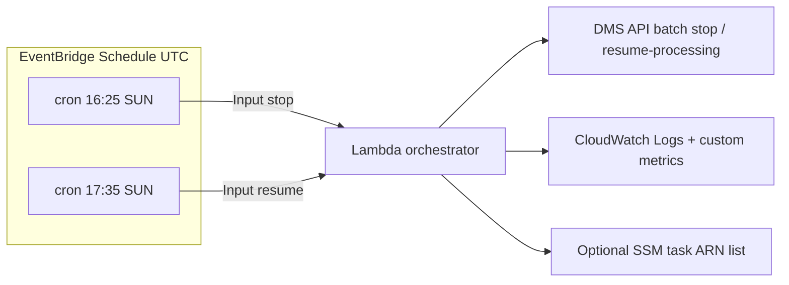

# DMS MongoDB maintenance — stop / resume

Production automation: EventBridge + Lambda stop all targeted DMS tasks before MongoDB maintenance, then resume with **`resume-processing`** only (checkpoint-based CDC), batched for scale.

**Region:** Deploy this stack in **a single AWS region** — default / recommended **`us-east-1`**. The Lambda, EventBridge rules, DMS API calls, and any SSM parameter you use must live in the **same region** as your replication tasks and replication instance.

---

## Architecture

**Goal:** Gracefully quiesce replication before MongoDB maintenance, then resume CDC from the last checkpoint so you avoid `reload-target` / full restarts and reduce connection storms.



**Why one Lambda, two rules:** Same code path, different `action` in the event. Stop and resume each complete within **15 minutes** with ~70 tasks, batches of 12, and ~90s between batches (~6 batches × 90s ≈ 9 minutes of sleep + API time). If you later increase volume or delays beyond **900s**, move to **Step Functions** (Map state + `Wait`) or split replication instances across multiple functions.

### Data loss / consistency (DMS behavior)

- **Stop** flushes state and leaves the task **stopped**; CDC position is kept for **CDC** / **full-load-and-cdc** tasks.
- **Resume** uses **`StartReplicationTaskType=resume-processing`** only (enforced in code), which continues from the **last recorded checkpoint** for eligible migration types—not a task recreate and not `reload-target`.

### Operational source of truth for 70+ tasks (pick one)

| Approach | Notes |
|----------|--------|
| **Recommended** | SSM Parameter Store `String` = JSON array of task ARNs (updated by IaC/CI when tasks change). Avoids pagination surprises and cross-team drift. Example name: `/prod/dms/mongo-maintenance-task-arns`. |
| **Dynamic** | `DMS_REPLICATION_INSTANCE_ARNS` (comma-separated); Lambda lists tasks per instance (handles pagination). |
| **Optional filter** | `DMS_TASK_IDENTIFIER_PREFIX` — only tasks whose **ReplicationTaskIdentifier** matches a prefix (e.g. `prod-mongo-`). |

---

## EventBridge cron (IST → UTC)

EventBridge schedules are **UTC**. India (**IST**) is **UTC+5:30** year-round (no DST). **`template.yaml`** uses:

| Intent | IST | UTC | `cron` expression |
|--------|-----|-----|-------------------|
| Stop ~9:55 PM Sunday | Sun 21:55 IST | Sun **16:25** UTC | `cron(25 16 ? * SUN *)` |
| Resume ~11:05 PM Sunday | Sun 23:05 IST | Sun **17:35** UTC | `cron(35 17 ? * SUN *)` |

---

## Deploy (single region — default `us-east-1`)

```bash
cd /path/to/dms-maintenance-handler-for-mongodb
sam build
# First time (parameters / S3 bucket):
sam deploy --guided
# Later (uses samconfig.toml — region us-east-1, stack dms-mongo-maintenance):
sam deploy
```

Stack parameters: set **`ReplicationInstanceArns`** and/or **`TaskArnsSsmParameter`**. DMS tasks and replication instance **must** be in the **same region** as this stack.

---

## Step-by-step implementation

1. **Choose task discovery:** Populate SSM (e.g. `/prod/dms/mongo-maintenance-task-arns`) **or** set replication instance ARNs in stack parameters.
2. **Deploy** in **`us-east-1`** (or your one production region): `sam build && sam deploy --guided --region us-east-1`.
3. **Tune:** `BATCH_SIZE` (10–15), `INTER_BATCH_DELAY_SEC` (60–120), `MAX_ATTEMPTS`, backoff env vars (see `lambda_function.py`).
4. **Dry run:** Set env `DRY_RUN=true` on the function, invoke with `{"action":"stop"}` / `{"action":"resume"}`, confirm logs; then remove `DRY_RUN`.
5. **Alarms:** Template includes **Lambda `Errors`**. Optionally add an alarm on custom metric **`DMS/MaintenanceOrchestrator` → `TasksFailed`** with dimension **`Action`** for task-level signal without parsing logs.
6. **Runbook:** If resume fails for a subset, logs include `failures` JSON; ops can **re-invoke** the same Lambda (idempotent skips for already running / already stopped where applicable).

---

## IAM permissions (least-privilege style)

| Area | Actions | Notes |
|------|---------|--------|
| DMS | `dms:ListReplicationTasks`, `dms:DescribeReplicationTasks`, `dms:StopReplicationTask`, `dms:StartReplicationTask` | `Resource: *` is usual for DMS control-plane APIs |
| Logs | `logs:CreateLogGroup`, `logs:CreateLogStream`, `logs:PutLogEvents` | Via `AWSLambdaBasicExecutionRole` |
| SSM (if used) | `ssm:GetParameter` | Scope to the **exact parameter ARN** in production |
| Metrics | `cloudwatch:PutMetricData` | Custom namespace from this function |

The SAM template embeds an inline policy (SSM path can be tightened to your parameter name).

---

## Error handling, retries, alert noise

- **Retries:** Exponential backoff + jitter on throttling / transient errors (`ThrottlingException`, etc.).
- **Idempotency:** Stop skipped if status already **`stopped` / `ready`**; resume skipped if **`running`**; DMS **`InvalidResourceStateFault`** on stop/resume treated as noop where appropriate.
- **CDC guard:** On resume, tasks with `MigrationType` not in **`cdc` / `full-load-and-cdc`** are skipped and counted (metric **`TasksSkippedNonCdc`**); they must not use `resume-processing` blindly.
- **Failures:** Any task-level failure marks the invocation failed (`RuntimeError`) so **Lambda Errors** fires **once per window**, not per task—keeps paging sane while still surfacing problems.

---

## Replication instance load

- **Batch size + inter-batch delay** throttle concurrent **start** operations (CPU, memory, connections to Mongo).
- Optionally **lower `BATCH_SIZE`** or **raise `INTER_BATCH_DELAY_SEC`** if CloudWatch shows replication-instance **CPU / FreeableMemory / SwapUsage** spikes after deploy.
- **Right-size** the replication instance class if 70 tasks share few instances.

---

## Edge cases (production)

- **Pure `cdc` tasks:** AWS docs sometimes distinguish first start vs resume; weekly **stop then resume** — `resume-processing` is the right semantic vs `reload-target`. If any task errors with an API message requiring **`start-replication`**, treat as **task-specific** (separate runbook), not a global code change, unless the fleet uniformly needs it.
- **Full-load-only tasks:** Skipped on resume when `REQUIRE_CDC=true`; they need an explicit decision (`start-replication` / reload), not this automation.
- **Lambda timeout:** If batches × delay approaches **900s**, use **Step Functions** or **shard** by replication instance (multiple Lambdas).
- **Maintenance drift:** If Mongo moves the window, adjust **UTC cron** (IST mapping: subtract 5h30 from IST for UTC).

---

## Code layout

| File | Role |
|------|------|
| `lambda_function.py` | Config, discovery, retries, metrics; handler does CDC filter, batching, **`resume-processing`** only. |
| `template.yaml` | SAM: Lambda, IAM, EventBridge schedules, CloudWatch alarm. |
| `requirements.txt` | `boto3` |
| `samconfig.toml` | Default **`region = "us-east-1"`**, stack **`dms-mongo-maintenance`** for `sam deploy`. |

Event payload: `{"action":"stop"}` or `{"action":"resume"}` — EventBridge rules in `template.yaml` set this automatically.

---

## Environment variables

| Variable | Purpose |
|----------|---------|
| `ACTION` | Optional default if event omits `action` |
| `DMS_TASK_ARNS` | Comma-separated ARNs (highest priority) |
| `DMS_TASK_ARNS_SSM_PARAMETER` | SSM parameter name for ARN list / JSON array |
| `DMS_REPLICATION_INSTANCE_ARNS` | Comma-separated; list tasks per instance |
| `DMS_TASK_IDENTIFIER_PREFIX` | Optional name filter |
| `BATCH_SIZE` | Default `12` |
| `INTER_BATCH_DELAY_SEC` | Default `90` |
| `MAX_ATTEMPTS` | Per API call retry chain |
| `BASE_BACKOFF_SEC` / `MAX_BACKOFF_SEC` / `JITTER_RATIO` | Retry tuning |
| `REQUIRE_CDC` | `true` skips unsafe resumes |
| `DRY_RUN` | Log only, no DMS mutations |
| `METRICS_NAMESPACE` | Default `DMS/MaintenanceOrchestrator` |

Stack parameters in `template.yaml` map to **`DMS_REPLICATION_INSTANCE_ARNS`** and **`DMS_TASK_ARNS_SSM_PARAMETER`** on the Lambda.
